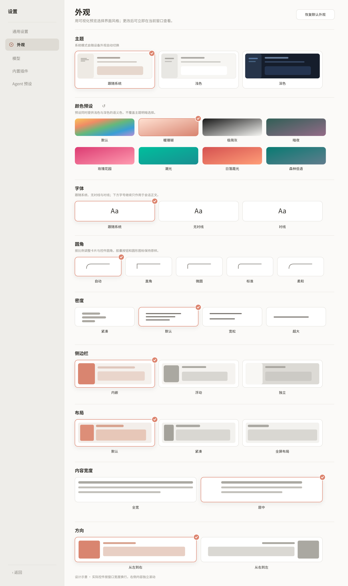

# AutoFlow Appearance page proposal

English | [中文](autoflow-appearance-proposal.zh.md)

This is a design proposal, illustrated by the [SVG page concept](assets/autoflow-appearance-concept.svg). It follows the existing full-window Settings page: a stable navigation rail on the left and an independently scrolling content area on the right. The illustrated controls are visual choices, not a claim that every option is implemented.

## Current behavior and ownership

The General section currently receives the light/dark/system selector and conversation font-size row from `ui-theme` through `settings.general.item`. `ui-theme` persists only `preference` and `fontSize` in the Host user-settings document. The Settings shell derives navigation from registered `settings.section` entries, so a new `appearance` section can be contributed by `ui-theme` without hard-coding its position in the shell. `ui-layout` applies the resolved theme snapshot; feature CSS consumes theme aliases.

Moving the existing selector and font-size control first preserves their storage and immediate-apply behavior. The General section should then stop rendering those rows; it continues to own its unrelated settings. The Appearance section uses the same left navigation highlight, collapsed glyph alignment, content width, title spacing, and light/dark surfaces as other Settings sections.

## Visual structure

| Group | Illustrated choice | Interaction and scope |
| --- | --- | --- |
| Theme | System, Light, Dark | Three mini window previews. The selected border and checkmark represent the stored preference; System follows the device's resolved scheme. |
| Color preset | Default, Warm Coral, Minimal Gray, Midnight, Rose Garden, Tidal, Sunset, Forest | Preview swatches show the palette; each preset needs a light and dark token pair and an explicit reset. The example names and colors are design candidates. |
| Font | System, Sans, Serif | Preview the actual fallback stack. Font family is separate from the existing conversation font-size control. |
| Radius | Automatic, Square, Subtle, Standard, Soft | Each sample depicts a corner. A scale changes component radii coherently while circles and pills keep their shape. |
| Density | Compact, Default, Relaxed, Spacious | The line artwork previews vertical spacing; font size does not silently change. |
| Sidebar | Embedded, Floating, Separate | Mini layout previews explain placement. This setting belongs with sidebar/layout ownership and needs collapsed and titlebar behavior before it becomes functional. |
| Layout | Default, Compact, Full-window | The previews show content proportions; they do not change feature navigation. |
| Content width | Full, Centered | A content-width preview makes the tradeoff legible at the current window size. |
| Direction | Left to right, Right to left | An RTL choice requires component and locale readiness; it is shown as a concept only. |

Use one selection language across groups: a thin accent outline, a small checked corner badge, a descriptive label below each SVG miniature, and clear hover/focus states. The miniature carries meaning rather than decoration. On narrow windows, cards wrap to fewer columns and the right content scrolls; the sidebar remains stable. The selected state must also be exposed through native radio semantics or `aria-checked`, so it is not conveyed by color alone.

## Implementation sequence

1. Register an `appearance` Settings section in `ui-theme`; move the existing theme selector and font-size row there with the current persistence and immediate update behavior. Remove their General-row registrations in the same change so each control appears once.
2. Add color preset and font-family settings only after defining the persisted values, their defaults, light/dark token mapping, available system-safe font stacks, and a reversible reset. Keep the chosen preset independent of Light/Dark/System.
3. Add radius and density as shared theme scales, updating the relevant semantic tokens rather than scattering per-component overrides. Review menus, cards, inputs, dialogs, focus rings, and reduced-transparency behavior in both schemes.
4. Treat sidebar mode, page layout, content width, and direction as separate layout/accessibility changes. Do not expose them as active controls until navigation, responsive behavior, window dragging, and RTL text/keyboard behavior are supported.

An illustrated option should be absent or explicitly identified as a preview in the live page until its state is implemented. Save behavior should remain immediate for the existing two settings; later controls should follow the same store and reconnect behavior. Reset returns each group to its documented default without changing unrelated groups.

## Review criteria

- Switching System, Light, and Dark preserves the existing preference after reopening Settings and follows the device when System is selected.
- Every color preset remains readable in both schemes; selected, hover, disabled, focus, error, and menu states use the chosen palette consistently.
- Font and radius previews match the actual page; narrow windows, collapsed navigation, Windows/macOS titlebars, and reduced transparency stay usable.
- A future option is counted as implemented only with persistence, locale copy, keyboard access, and focused browser evidence.
